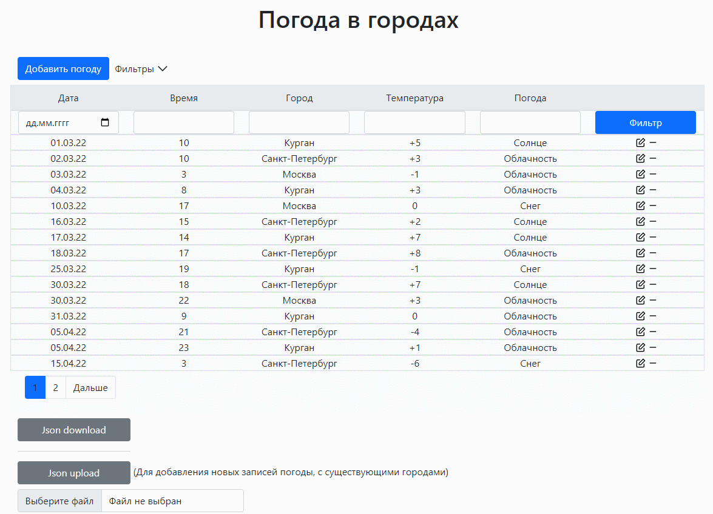
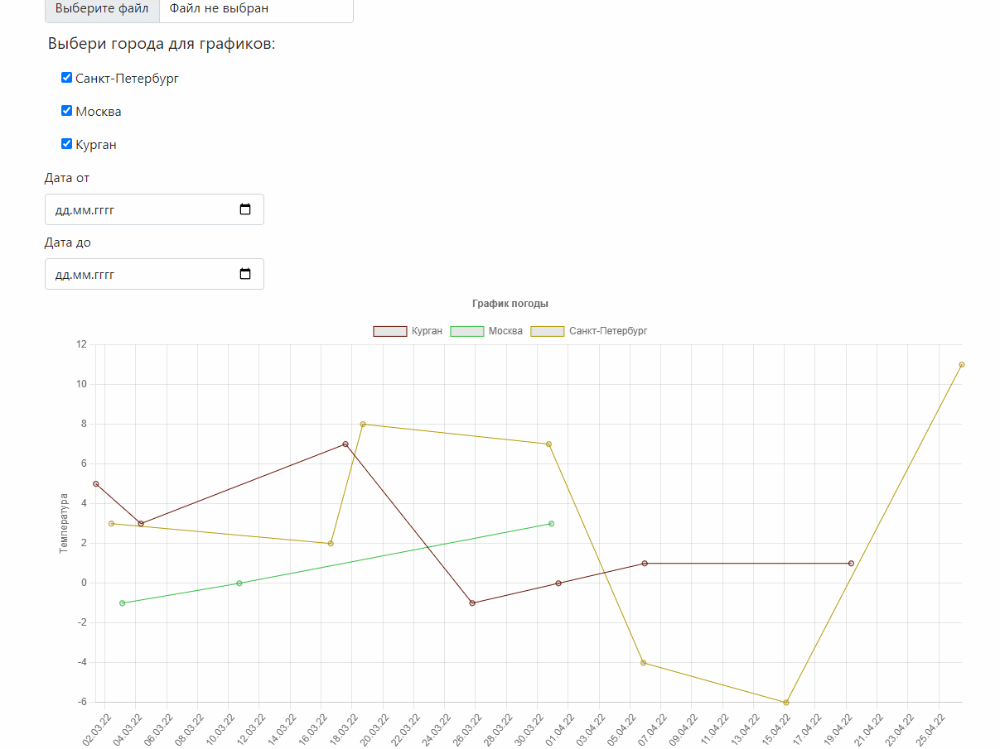
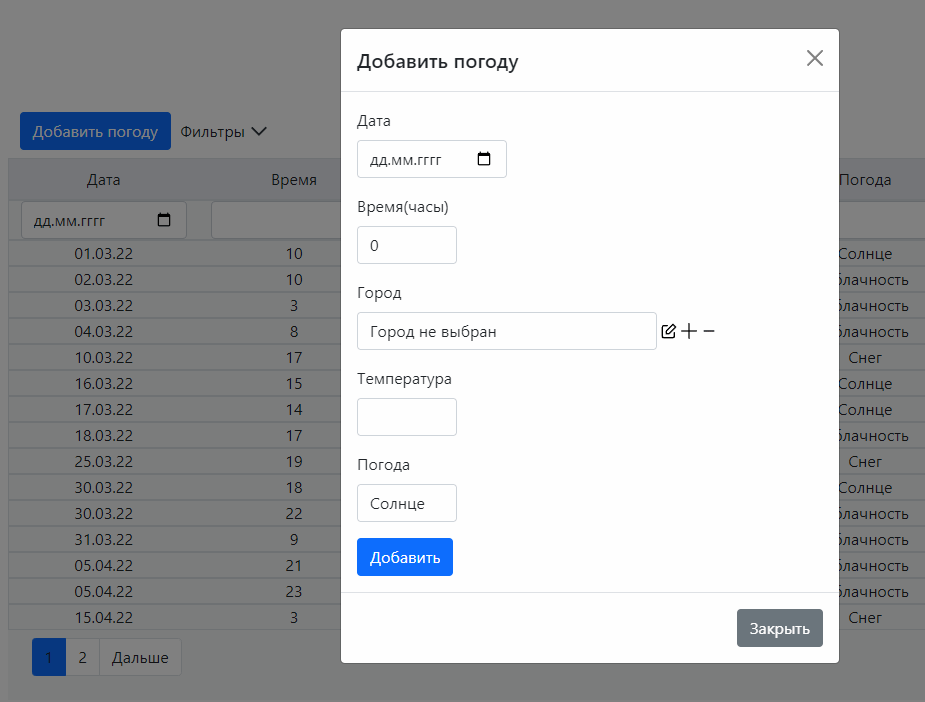

## Тестовый дашборд
- Позволяет просматривать и фильтровать данные о погоде в городах по условиям.
- Позволяет создавать города и погоду в городах.  
- Позволяет выгружать данные в JSON, а также загружать новые данные о погоде, при условии что города уже существуют.  
- Позволяет строить исторические графики погоды, с учетом выбранного интервала.  

## Установка проекта:
- Установка python зависимостей:  
pip install -r requirements.txt

- Установить node js + npm

- Установка js зависимостей:  
В директории с файлом package-lock.json вызвать команду:  
npm install  
При этом создастся папка node_modules с зависимости  

- Сборка статических файлов:  
python manage.py collecstatic   
При этом берутся статика из папки приложения + зависимости из node_modules чере django_node_assets  

## Скриншоты:

